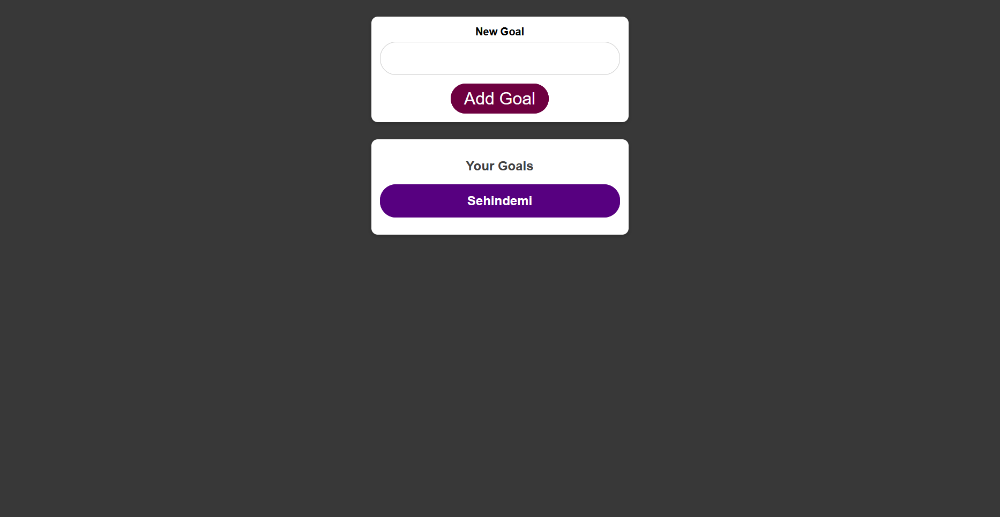

# Goals API - Full Stack DevOps Project

A full-stack application to manage personal goals, built with a Node.js/Express backend and a React frontend, containerized with Docker, and deployed using AWS ECS Fargate. The app features end-to-end DevOps integration with secrets management.

---

## 🧭 Project Overview

This project allows users to set, view, and delete personal goals. It demonstrates cloud-native application deployment using best practices in modern DevOps:

* Frontend & Backend Dockerized
* Hosted on AWS ECS with ALB and Route 53
* Secrets stored in SSM Parameter Store

---

## 🏗️ Architecture Overview

```
[User] --> [Route 53] --> [ALB] --> [ECS Service - Fargate Task] --> [Backend API - Node.js/Express]
                                                    |
                                                    --> [MongoDB Atlas (Remote)]
[User] --> [Frontend - React SPA hosted in same ECS task or via S3+CloudFront]
```

---

## 🚀 Features

* 🎯 Add, delete, and view personal goals
* 🔐 Secure backend API with environment-managed secrets
* 🐳 Dockerized backend and frontend
* 🌍 Custom domain via Route 53

---

## ⚙️ Tech Stack

### Frontend:

* React
* HTML/CSS (custom styles)

### Backend:

* Node.js
* Express.js
* MongoDB (via Mongoose)

### DevOps:

* Docker (multi-stage build)

---

## ☁️ Infrastructure Stack (AWS)

* **ECS (Fargate)**: Container orchestration
* **ECR**: Docker image registry
* **ALB**: Load balancing
* **Route 53**: DNS management
* **SSM Parameter Store**: Secret management
* **CloudWatch Logs**: Logging & monitoring

---

## 🧪 Local Development

```bash
# Backend
cd backend
npm install
npm run start

# Frontend
cd frontend
npm install
npm start
```

**Docker Compose (optional)**

```bash
docker-compose up --build
```

---

## 📦 Production Deployment

Infrastructure was provisioned manually. ECS services and task definitions were created and associated with an ALB. Steps:

1. **Build Docker images**

```bash
docker build -t goals-api-backend .
docker build -t goals-api-frontend -f Dockerfile.prod .
```

2. **Push to ECR**

```bash
ecr-login

docker tag goals-api-backend <account-id>.dkr.ecr.<region>.amazonaws.com/goals-api-backend

docker push <ecr-url>
```

3. **Deploy via ECS Fargate**

* Task definitions created specifying container settings and ECR image URIs
* ECS services launched using those task definitions
* ALB configured with listener rules and target groups pointing to ECS services

---

## 📸 Screenshots



```md

```

---

## 🤝 Contributing

Pull requests are welcome! To contribute:

```bash
git clone https://github.com/yourusername/goals-api.git
npm install
# run the app
```

---

## 📄 License

MIT © Sehindemi 2025
